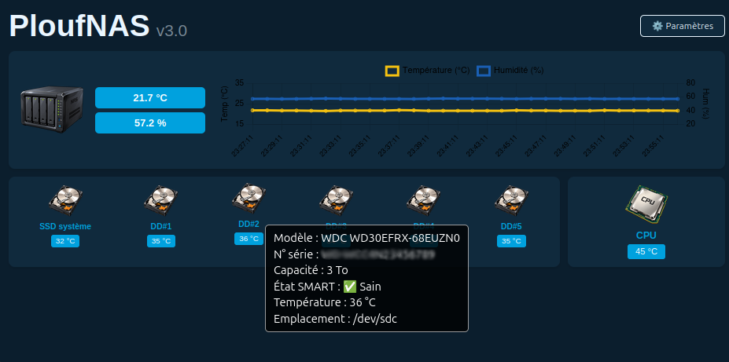

# 💧 PloufNAS

Un NAS, comme tout ordinateur, possède des capteurs de température mais pas de capteur d'humidité !

C'est pourquoi je vous propose un système complet et robuste de surveillance de la température et de l'humidité, connecté à un NAS OpenMediaVault (OMV). Ce projet combine un capteur SHT31 branché sur une carte Arduino, un stockage sécurisé sur RAID et un tableau de bord web personnalisé avec thèmes dynamiques et alertes push via serveur de notification ntfy (ici déployé avec Docker).


## 📸 Aperçu du projet

<table>
  <tr>
    <td align="center"><br><i>Capteur SHT31</i></td>
    <td align="center"><br><i>NAS</i></td>
  </tr>
  <tr>
    <td align="center"><br><i>Prototype</i></td>
    <td align="center"><br><i>Interface Web Basique</i></td>
    <td align="center"><br><i>Interface Web Avancée</i></td> 
  </tr>
</table>

---

## ✨ Fonctionnalités

- **Acquisition fiable** : Lecture du capteur SHT31 (Température + Humidité) via Arduino.
- **Stockage robuste** : Enregistrement continu des données dans un fichier CSV sur le volume de stockage.
- **Dashboard Web** : Interface légère en Flask + Chart.js, accessible sur tout le réseau local.
- **Thèmes personnalisés** : 16 thèmes intégrés (Sombres, Clairs, et "Pouêt-Pouêt") avec sélection aléatoire au chargement.
- **Alertes push** : Notifications en temps réel via **ntfy** (auto-hébergé) si les seuils de température ou d'humidité sont dépassés.
- **Alerte "pas de données"** : Notification si aucune donnée n'est reçue depuis plus de 15 minutes (détection d'un capteur débranché ou d'un service planté).
- **Démarrage automatique** : Gestion via `systemd` pour une exécution en arrière-plan au démarrage du NAS.

---

## 🛠️ Matériel requis

- 1x Arduino (Uno, Nano ou compatible)
- 1x Capteur de température et d'humidité **SHT31** (interface I2C)
- 1x Écran LCD I2C 16x2 (optionnel, pour affichage local sur l'Arduino)
- 1x Câble USB **de données** (Attention : beaucoup de câbles USB ne font que la charge !)
- 1x NAS sous OpenMediaVault (OMV) avec un dossier partagé configuré

---

## 🔌 Câblage

| Composant | Broche | Connexion Arduino |
| :--- | :---: | :--- |
| **SHT31** | VIN | 3.3V |
| | GND | GND |
| | SCL-T | A5 (SCL) |
| | SAA-RH | A4 (SDA) |
| **LCD I2C** | VCC | 5V |
| | GND | GND |
| | SDA | A4 (SDA) |
| | SCL | A5 (SCL) |

*(Les broches AL/AD du SHT31 doivent rester non connectées pour utiliser l'adresse I2C par défaut `0x44`)*.

---

## 💻 Installation

### Étape 1 : Configuration Arduino

1. Installez les bibliothèques suivantes via le gestionnaire de bibliothèques de l'IDE Arduino :
   - `LiquidCrystal I2C` (par Frank de Brabander)
   - `SHT31` (par Rob Tillaart)
2. Téléversez le code situé dans `arduino/sht31_nas_monitor.ino`.
3. Ouvrez le moniteur série à **9600 bauds** pour vérifier que les données `DATA,Temp,Hum` s'affichent.

### Étape 2 : Préparation du NAS (OpenMediaVault)

1. Créez un dossier partagé nommé `monitoring` sur votre volume de stockage principal via l'interface OMV.
2. Notez le chemin réel de ce dossier. Vous pouvez le trouver via l'interface OMV ou en tapant `lsblk -f` dans le terminal.

### Étape 3 : Règle Udev (Port Série Fixe)

Pour éviter que le nom du port Arduino (`/dev/ttyUSB0`) ne change au redémarrage :

1. Copiez le fichier `nas/99-arduino-nas.rules` dans `/etc/udev/rules.d/` sur le NAS.
2. Rechargez les règles et redémarrez le service udev :

   ```bash
   sudo udevadm control --reload-rules
   sudo udevadm trigger
   ```

3. Vérifiez que le symlink a bien été créé :

   ```bash
   ls -l /dev/arduino_nas
   ```

   → Doit afficher un lien vers `/dev/ttyUSB0` (ou `ttyACM0`).

> 💡 Si le symlink n'apparaît pas, débranchez/rebranchez l'Arduino et relancez `sudo udevadm trigger`.

---

### Étape 4 : Installation de ntfy (alertes push)

Le projet utilise **ntfy** pour l'envoi des notifications. Nous allons l'auto-héberger sur le NAS via Docker.

#### 4.1 — Installation de Docker sur OMV

Dans l'interface web OMV :

1. **Système → omv-extras** : cochez le dépôt **Docker repo**, enregistrez.
2. **Système → Plugins** : installez `openmediavault-compose`.
3. **Services → Compose → Paramètres** :
   - **Compose Files** : sélectionnez un dossier partagé (ex. `docker-compose`)
   - **Data** : sélectionnez un dossier partagé (ex. `docker-data`)
   - **Docker storage** : sélectionnez un dossier partagé (ex. `docker`)
   - Enregistrez et appliquez.

> 💡 Il faut **trois dossiers partagés distincts** pour que le plugin Compose fonctionne correctement.

#### 4.2 — Création du conteneur ntfy

Allez dans **Services → Compose → Fichiers → Ajouter** :

- **Nom** : `ntfy`
- **Contenu** :

```yaml
services:
  ntfy:
    image: binwiederhier/ntfy
    container_name: ntfy
    command: serve
    environment:
      - TZ=Europe/Paris
    volumes:
      - CHANGE_TO_COMPOSE_DATA_PATH/ntfy/cache:/var/cache/ntfy
      - CHANGE_TO_COMPOSE_DATA_PATH/ntfy/config:/etc/ntfy
    ports:
      - "8080:80"
    restart: unless-stopped
```

Enregistrez, puis allez dans **Services → Compose → Services** et démarrez `ntfy`.

#### 4.3 — Configuration du téléphone

1. Installez l'application **ntfy** :
   - [Android (Play Store)](https://play.google.com/store/apps/details?id=io.heckel.ntfy)
   - [Android (F-Droid)](https://f-droid.org/packages/io.heckel.ntfy/)
   - [iOS (App Store)](https://apps.apple.com/app/ntfy/id1625396347)
2. Dans l'app, ajoutez un serveur personnalisé : `http://IP-DU-NAS:8080`
3. Abonnez-vous à un topic, par exemple `mon-nas-climat-alerte`.

> ⚠️ **IMPORTANT — Choisissez votre propre topic !**
>
> Le topic ntfy fait office de **mot de passe** : quiconque connaît son nom peut lire et écrire dedans (si vous n'activez pas l'authentification).
>
> Utilisez un nom **long, unique et difficile à deviner**, par exemple :
> ```bash
> echo "mon-nas-climat-$(openssl rand -hex 6)"
> # → ex: mon-nas-climat-a7f3k9x2m4p8
> ```
>
> Ne réutilisez **jamais** un nom de topic trouvé dans un tuto ou un exemple public.

#### 4.4 — Test de la chaîne

Depuis le NAS en SSH :

```bash
curl -d "Test alerte climat" http://localhost:8080/VOTRE-TOPIC
```

→ La notification doit apparaître sur le téléphone en quelques secondes.

---

### Étape 5 : Déploiement des scripts sur le volume de stockage

**1. Trouvez l'UUID de votre volume :**

```bash
lsblk -f
```

Repérez la ligne correspondant à votre disque/RAID, et copiez la valeur dans la colonne `UUID`.

**2. Copiez les scripts au bon endroit :**

```bash
# Créer le dossier monitoring sur le volume
sudo mkdir -p /srv/dev-disk-by-uuid-VOTRE_UUID/monitoring

# Copier les scripts depuis le repo cloné
sudo cp ~/PloufNAS/nas/monitor_climat.py \
        ~/PloufNAS/nas/setup_dashboard.py \
        /srv/dev-disk-by-uuid-VOTRE_UUID/monitoring/

# Générer dashboard.py
cd /srv/dev-disk-by-uuid-VOTRE_UUID/monitoring/
sudo python3 setup_dashboard.py

# Vérifier
ls -la
```

**3. Personnalisez `monitor_climat.py` :**

Éditez le fichier et adaptez la section **CONFIGURATION** en haut :

```python
port_serie  = '/dev/arduino_nas'
fichier_log = '/srv/dev-disk-by-uuid-VOTRE_UUID/monitoring/climat.csv'

TEMP_MAX = 30.0    # °C
HUM_MAX  = 80.0    # %

NTFY_URL = "http://localhost:8080/VOTRE-TOPIC"
```

---

### Étape 6 : Installation des dépendances Python

En SSH sur le NAS :

```bash
# Outils de base (si non installés)
sudo apt update
sudo apt install -y python3 python3-pip python3-venv curl

# Dépendances nécessaires
sudo pip3 install pyserial flask requests
```

> ⚠️ Les services fournis dans `nas/*.service` utilisent `User=root` et `/usr/bin/python3` (Python système, pas de venv). C'est fonctionnel mais peu élégant côté sécurité. Pour un usage domestique sur réseau local, ça reste acceptable.

---

### Étape 7 : Test manuel avant systemd

**Testez toujours à la main avant d'activer les services** — sinon vous déboguez à l'aveugle.

```bash
cd /srv/dev-disk-by-uuid-VOTRE_UUID/monitoring/

# Terminal 1 : collecteur (lecture série → CSV + alertes ntfy)
sudo python3 monitor_climat.py

# Terminal 2 : dashboard Flask
sudo python3 dashboard.py
```

→ Vous devez recevoir une notification `[OK] Monitoring climatique demarre` sur le téléphone.
→ Puis depuis un navigateur du réseau : `http://IP-DU-NAS:5000`

Si tout fonctionne → passez à systemd. Sinon → inspectez les erreurs affichées.

---

### Étape 8 : Installation des services systemd

Les fichiers sont fournis dans `nas/`. Il faut les copier dans `/etc/systemd/system/` :

```bash
sudo cp ~/PloufNAS/nas/monitor-climat.service /etc/systemd/system/
sudo cp ~/PloufNAS/nas/dashboard-climat.service /etc/systemd/system/

# Recharger systemd
sudo systemctl daemon-reload

# Activer + démarrer
sudo systemctl enable --now monitor-climat.service
sudo systemctl enable --now dashboard-climat.service

# Vérifier l'état
systemctl status monitor-climat.service
systemctl status dashboard-climat.service

# Logs en direct
journalctl -u monitor-climat.service -f
journalctl -u dashboard-climat.service -f
```

---

### Étape 9 : Accès au dashboard

Depuis un navigateur sur le réseau local :

```
http://IP-DU-NAS:5000
```

Pour trouver l'IP du NAS :

```bash
hostname -I
```

**Optionnel** — accès depuis l'extérieur : passez **obligatoirement** par un reverse-proxy (nginx d'OMV) avec HTTPS et une authentification. ⚠️ **N'exposez jamais Flask directement sur Internet.**

---

### Étape 10 : Vérification du bon fonctionnement

Checklist après installation :

- [ ] Le fichier CSV se remplit bien (1 ligne/minute)
- [ ] Le dashboard affiche les données
- [ ] Les valeurs changent si on souffle sur le capteur
- [ ] Après `sudo reboot`, les deux services redémarrent seuls
- [ ] La notification de démarrage `[OK]` arrive sur le téléphone
- [ ] L'alerte humidité > 80 % se déclenche (souffler sur le capteur)
- [ ] L'alerte température > 30 °C se déclenche (si testable)

---

## 🔔 Personnalisation des alertes

Tous les paramètres sont regroupés en haut de `monitor_climat.py` :

| Paramètre | Description | Valeur par défaut |
|---|---|---|
| `TEMP_MAX` | Seuil de température (°C) | `30.0` |
| `HUM_MAX` | Seuil d'humidité (%) | `80.0` |
| `NTFY_URL` | URL ntfy + topic | `http://localhost:8080/VOTRE-TOPIC` |
| `DELAI_SANS_DONNEES` | Délai avant alerte "pas de données" | `15 * 60` (15 min) |
| `INTERVALLE_LECTURE` | Fréquence de lecture du port série | `5` (secondes) |
| `INTERVALLE_ECRITURE` | Fréquence d'écriture dans le CSV | `60` (secondes) |

**Logique anti-spam** : le script n'envoie une notification **qu'aux transitions** :
- Normal → Alerte : 1 notification
- Alerte → Normal : 1 notification (retour à la normale)
- Alerte → Alerte : aucune notification (pas de spam)

---

## 🔧 Dépannage

| Symptôme | Piste à explorer |
|---|---|
| Port série absent | Vérifiez `/dev/ttyUSB*` / `/dev/ttyACM*`, `lsusb`, `dmesg \| tail` |
| Données illisibles | Baudrate 9600 ? Droits série (`dialout`) ? |
| CSV vide | `journalctl -u monitor-climat -n 50` |
| `dashboard.py` introuvable | Relancez `sudo python3 setup_dashboard.py` |
| Dashboard inaccessible | Bonne IP ? Pare-feu OMV ? Port 5000 ouvert ? |
| Thème ne change pas | Videz le cache navigateur (Ctrl+F5) |
| Service ne démarre pas | `journalctl -u <monitor-climat\|dashboard-climat> -xe` |
| Erreur "UUID not found" | Vérifiez que `VOTRE_UUID` a bien été remplacé |
| **Erreur `latin-1 codec can't encode`** | Un emoji est présent dans un **titre** de notification. Les titres ne doivent contenir que de l'ASCII — les emojis sont OK dans le **corps** du message. |
| Notification ntfy non reçue | Vérifiez que le conteneur tourne : `docker ps \| grep ntfy` |
| ntfy inaccessible | Testez `curl http://localhost:8080/v1/health` sur le NAS |
| Alerte humidité non déclenchée | Le script lit le buffer série en entier (corrigé). Si le problème persiste, vérifiez le code Arduino. |

---

## 🔐 Sécurité

- ❌ Ne **jamais** exposer Flask ou ntfy directement sur Internet
- ✅ Ajouter une **authentification** (`flask-httpauth` pour le dashboard, ou auth ntfy)
- ✅ Restreindre l'accès au **LAN** via pare-feu
- ✅ Les services tournent en `root` — acceptable en LAN, à durcir (user dédié) si exposé
- ✅ Choisir un **nom de topic ntfy long et aléatoire** (il fait office de mot de passe)
- ✅ Garder le système à jour (`sudo apt update && sudo apt upgrade`)

---

## 📄 Format du fichier CSV

```csv
Date et Heure,Temperature_C,Humidite_Pct
2026-09-17 19:15:00,22.4,47.2
2026-09-17 19:16:00,22.5,47.0
```

---

## 📜 Licence

Ce projet est placé sous licence **GNU General Public License v3.0** — voir le fichier [`LICENSE`](./LICENSE).

### 💡 Pourquoi ce projet est-il sous licence libre ?

Ce projet s'inscrit dans la philosophie du logiciel libre, promue par des associations comme [April](https://www.april.org/).

Le partage des connaissances et des outils est essentiel pour une société numérique plus juste et transparente.

---

## 🤝 Contribution

Les PR sont bienvenues ! Ouvrez d'abord une *issue* pour discuter de votre idée avant de coder.

---

## 🙏 Remerciements

- [Rob Tillaart](https://github.com/RobTillaart/SHT31) pour la bibliothèque `SHT31`
- [Frank de Brabander](https://github.com/johnrickman/LiquidCrystal_I2C) pour `LiquidCrystal I2C`
- [binwiederhier](https://github.com/binwiederhier/ntfy) pour **ntfy**
- La communauté OpenMediaVault pour la documentation