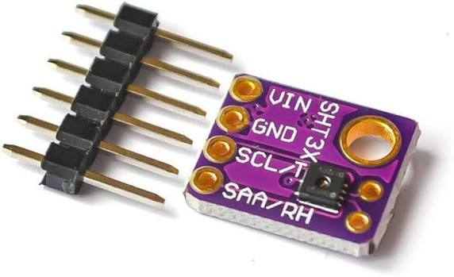
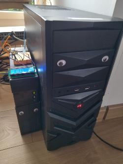
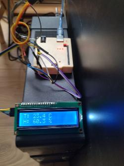
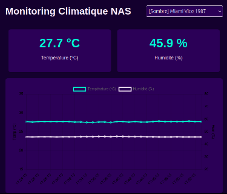

cat << 'EOF' > README.md
# 🌡️ Monitoring Climatique NAS

Un système complet et robuste de surveillance de la température et de l'humidité, connecté à un NAS OpenMediaVault (OMV). Ce projet combine un capteur Arduino, un stockage sécurisé sur RAID et un tableau de bord web personnalisé avec thèmes dynamiques et alertes.


## 📸 Aperçu du projet

<table>
  <tr>
    <td align="center"><br><i>Capteur SHT31</i></td>
    <td align="center"><br><i>Installation sur le NAS</i></td>
  </tr>
  <tr>
    <td align="center"><br><i>Prototype de test</i></td>
    <td align="center"><br><i>Interface Web Dashboard</i></td>
  </tr>
</table>

---

## ✨ Fonctionnalités

- **Acquisition fiable** : Lecture du capteur SHT31 (Température + Humidité) via Arduino.
- **Stockage robuste** : Enregistrement continu des données dans un fichier CSV sur le volume de stockage.
- **Dashboard Web** : Interface légère en Flask + Chart.js, accessible sur tout le réseau local.
- **Thèmes personnalisés** : 16 thèmes intégrés (Sombres, Clairs, et "Pouêt-Pouêt") avec sélection aléatoire au chargement.
- **Système d'alerte** : Notification visuelle (cadre rouge pulsant) si l'humidité dépasse 80%.
- **Démarrage automatique** : Gestion via `systemd` pour une exécution en arrière-plan au démarrage du NAS.

---

## 🛠️ Matériel requis

- 1x Arduino (Uno, Nano ou compatible)
- 1x Capteur de température et d'humidité **SHT31** (interface I2C)
- 1x Écran LCD I2C 16x2 (optionnel, pour affichage local sur l'Arduino)
- 1x Câble USB **de données** (Attention : beaucoup de câbles USB ne font que la charge !)
- 1x NAS sous OpenMediaVault (OMV) avec un dossier partagé configuré

---

## 🔌 Câblage

| Composant | Broche | Connexion Arduino |
| :--- | :---: | :--- |
| **SHT31** | VIN | 5V (ou 3.3V) |
| | GND | GND |
| | SCL-T | A5 (SCL) |
| | SAA-RH | A4 (SDA) |
| **LCD I2C** | VCC | 5V |
| | GND | GND |
| | SDA | A4 (SDA) |
| | SCL | A5 (SCL) |

*(Les broches AL/AD du SHT31 doivent rester non connectées pour utiliser l'adresse I2C par défaut `0x44`)*.

---

## 💻 Installation

### Étape 1 : Configuration Arduino
1. Installe les bibliothèques suivantes via le gestionnaire de bibliothèques de l'IDE Arduino :
   - `LiquidCrystal I2C` (par Frank de Brabander)
   - `SHT31` (par Rob Tillaart)
2. Téléverse le code situé dans `arduino/sht31_nas_monitor.ino`.
3. Ouvre le moniteur série à **9600 bauds** pour vérifier que les données `DATA,Temp,Hum` s'affichent.

### Étape 2 : Préparation du NAS (OpenMediaVault)
1. Crée un dossier partagé nommé `monitoring` sur ton volume de stockage principal via l'interface OMV.
2. Note le chemin réel de ce dossier. Tu peux le trouver via l'interface OMV ou en tapant `lsblk -f` dans le terminal.

### Étape 3 : Règle Udev (Port Série Fixe)
Pour éviter que le nom du port Arduino (`/dev/ttyUSB0`) ne change au redémarrage :
1. Copie le fichier `nas/99-arduino-nas.rules` dans `/etc/udev/rules.d/` sur le NAS.
2. Recharge les règles et redémarre le service udev :
   ```bash
   sudo udevadm control --reload-rules
   sudo udevadm trigger
